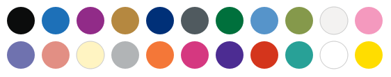
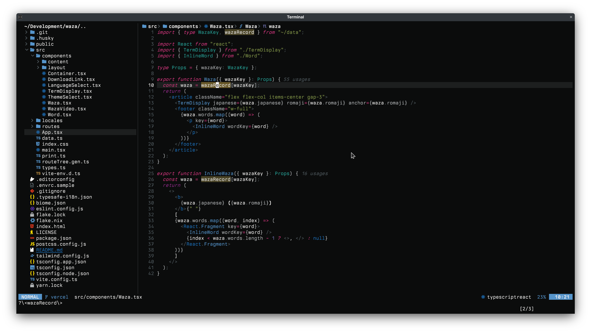
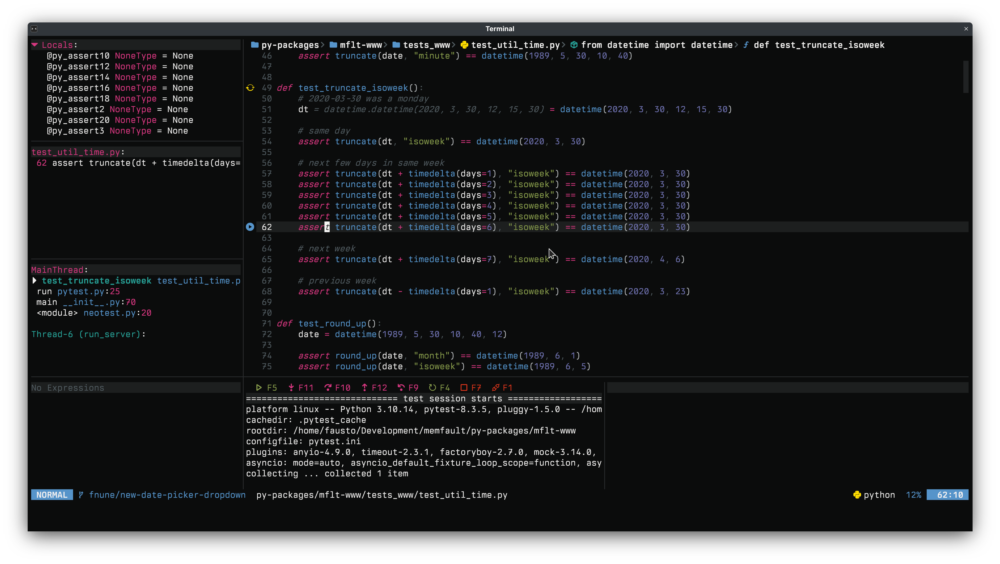

# `standard` colors



An accessible color scheme inspired by [GOV.UK colors][govuk]. Built to be
clear, consistent, and something you can stick with long-term.

## Table of Contents

- [Principles](#principles)
- [Screenshots](#screenshots)
- [Installation](#installation)
  - [Neovim](#neovim)
    - [Lualine](#lualine)
    - [Other plugins](#other-plugins)
  - [Kitty](#kitty)
  - [Tmux](#tmux)
  - [FZF](#fzf)
  - [Bat](#bat)
- [Contributing](#contributing)

## Principles

- Text and information should use very accessible colors
- Interface elements can blend more into the background, and this should aid in
  making the content stand out

[govuk]: https://design-system.service.gov.uk/styles/colour/

> ℹ️ `vim.o.background = "light"` is supported only experimentally. I do not
> use it and I currently treat it as a second-class citizen.

## Screenshots


_TypeScript code inside Neovim using Treesitter highlighting._


_Debugging a Python test using Neotest._


_Error handling built-ins use special colors._


_Showcasing Kitty, `tmux`, FZF, and `bat` support._

The font in these screenshots is [Berkeley Mono](https://usgraphics.com/products/berkeley-mono).

## Installation

### Neovim

```lua
-- Using lazy.nvim
{
  "fnune/standard",
  lazy = false,
  priority = 1000,
  config = function()
    require("standard").setup({})
    vim.cmd("colorscheme standard")
  end,
}
```

#### Lualine

```lua
require('lualine').setup {
  options = {
    theme = 'standard'
  }
}
```

#### Other plugins

The following plugins are supported with custom highlight groups:

- Treesitter
- Neorg
- Git (GitGutter, GitSigns)
- Neogit
- Diffview
- Neotest
- `nvim-dap-ui`
- Telescope
- Illuminate
- NvimTree
- Dropbar
- Aerial
- `nvim-scrollbar`
- `blink.cmp`
- `snacks.nvim`

Support for other plugins may be added in the future. All plugin support is
enabled by default. See [`highlights.lua`](./lua/standard/highlights.lua) for
specifics.

### Kitty

Add to your kitty.conf:

```
include /path/to/standard/kitty/standard.dark.conf
```

### Tmux

Add to your tmux.conf:

```
source-file /path/to/standard/tmux/standard.dark.conf
```

### FZF

Source the script:

```bash
source /path/to/standard/fzf/standard.dark.sh
```

### Bat

Works well with the base16 theme in Bat:

```bash
export BAT_THEME="base16"
```

## Contributing

You can contribute to `standard` in multiple ways:

### Development Environment Setup

#### Using Nix (recommended)

This project includes a Nix flake for development. If you have Nix with flakes enabled:

1. Copy the `.envrc.sample` file to `.envrc` (or run `echo "use flake" > .envrc` if you use direnv)
2. If you use direnv, run `direnv allow` to automatically set up your environment
3. Otherwise, run `nix develop` to enter the development shell

The Nix environment provides all needed tools:

- `biome`
- `lua-language-server`
- `luacheck`
- `nodejs`
- `stylua`
- `yarn`

#### Without Nix

If you're not using Nix, you'll need to install these tools manually:

- Node.js and Yarn for JavaScript tooling
- LuaCheck and Stylua for Lua formatting and linting
- Lua Language Server for Lua language support

After installing the dependencies, you can run:

```bash
yarn install
yarn format
yarn lint
```

### Understanding the Codebase

The colorscheme is organized around two main concepts:

1. **Tokens** - The raw color values in `palette.lua`
   - These are stored in the `accessible` and `lowcontrast` tables
   - These define the base colors that match the GOV.UK design system
2. **Decisions** - How colors are applied in `M.colors`
   - The `M.colors` table maps tokens to specific UI elements and syntax
   - This is where the actual colorscheme design happens
   - Organized by categories like `interface`, `intent`, `diff`, `syntax`, etc.

When contributing, consider whether you're:

- Adding a new token (rare, unless extending the base palette)
- Changing a decision about how an existing token is applied
- Adding support for a new plugin or UI element

Please include screenshots of your changes when applicable.
