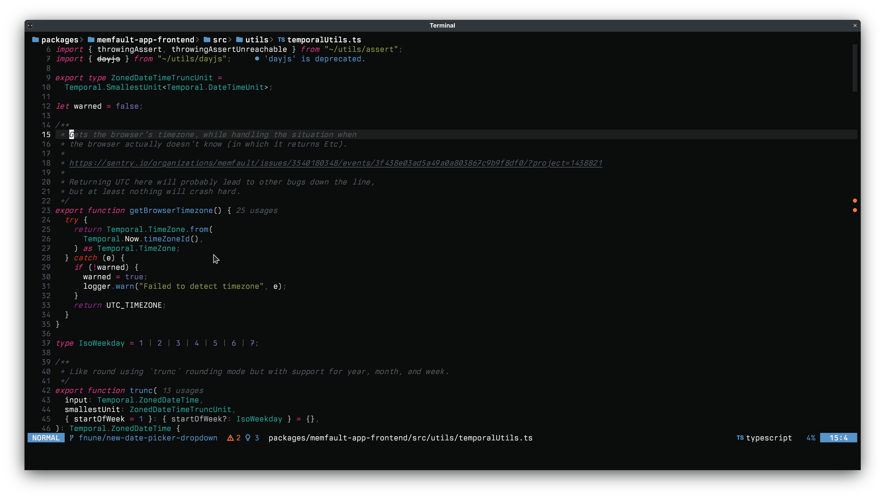
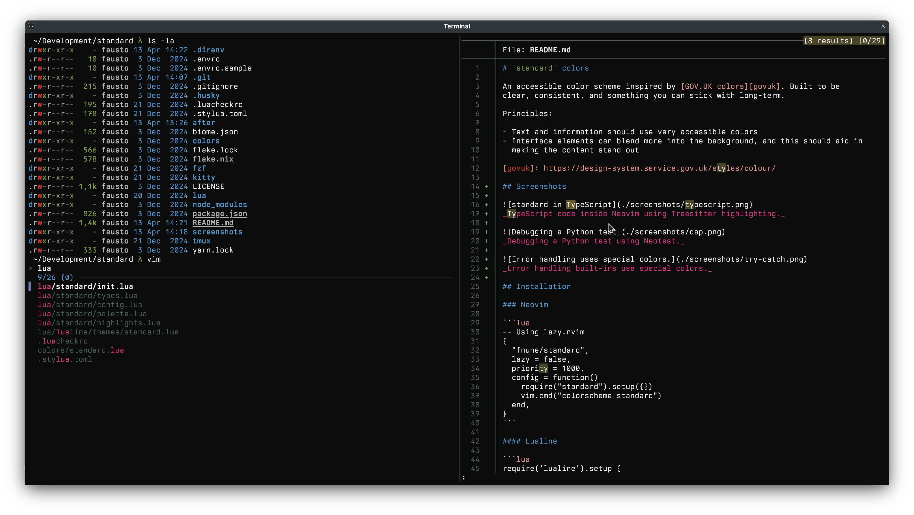

# `standard` colors

An accessible color scheme inspired by [GOV.UK colors][govuk]. Built to be
clear, consistent, and something you can stick with long-term.

Principles:

- Text and information should use very accessible colors
- Interface elements can blend more into the background, and this should aid in
  making the content stand out

[govuk]: https://design-system.service.gov.uk/styles/colour/

> ℹ️ `vim.o.background = "light"` is supported only experimentally. I do not
> use it and I currently treat it as a second-class citizen.

## Screenshots


_TypeScript code inside Neovim using Treesitter highlighting._


_Debugging a Python test using Neotest._


_Error handling built-ins use special colors._


_Showcasing Kitty, `tmux`, FZF, and `bat` support._

## Installation

### Neovim

```lua
-- Using lazy.nvim
{
  "fnune/standard",
  lazy = false,
  priority = 1000,
  config = function()
    require("standard").setup({})
    vim.cmd("colorscheme standard")
  end,
}
```

#### Lualine

```lua
require('lualine').setup {
  options = {
    theme = 'standard'
  }
}
```

#### Other plugins

The following plugins are supported with custom highlight groups:

- Treesitter
- Neorg
- Git (GitGutter, GitSigns)
- Neogit
- Diffview
- Neotest
- `nvim-dap-ui`
- Telescope
- Illuminate
- NvimTree
- Dropbar
- Aerial
- `nvim-scrollbar`
- `blink.cmp`
- `snacks.nvim`

Support for other plugins may be added in the future. All plugin support is
enabled by default. See [`highlights.lua`](./lua/standard/highlights.lua) for
specifics.

### Kitty

Add to your kitty.conf:

```
include /path/to/standard/kitty/standard.dark.conf
```

### Tmux

Add to your tmux.conf:

```
source-file /path/to/standard/tmux/standard.dark.conf
```

### FZF

Source the script:

```bash
source /path/to/standard/fzf/standard.dark.sh
```

### Bat

Works well with the base16 theme in Bat:

```bash
export BAT_THEME="base16"
```
